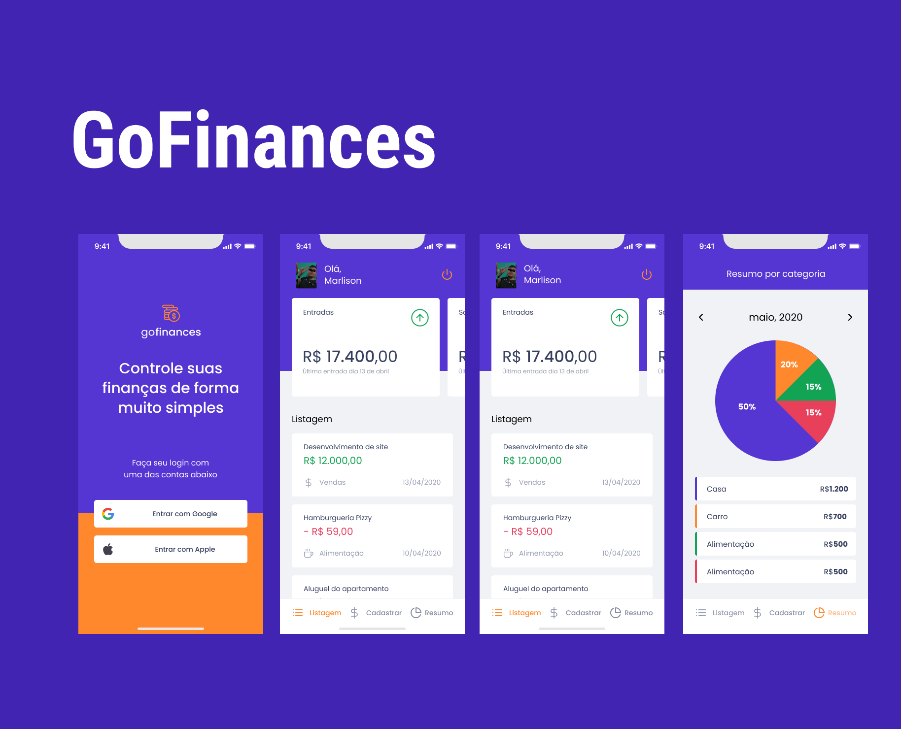

<h1 align="center"> GoFinances 🚀</h1>

<p align="center">
  <a href="#-tecnologias">Tecnologias</a>&nbsp;&nbsp;&nbsp;|&nbsp;&nbsp;&nbsp;
  <a href="#-projeto">Projeto</a>&nbsp;&nbsp;&nbsp;|&nbsp;&nbsp;&nbsp;
  <a href="#-layout">Layout</a>&nbsp;&nbsp;&nbsp;|&nbsp;&nbsp;&nbsp;
    <a href="#-clonando-o-projeto-para-sua-máquina">Clonar</a>&nbsp;&nbsp;&nbsp;
</p>

<br>

<p align="center">
  
</p>

## 🚀 Tecnologias

Esse projeto foi desenvolvido com as seguintes tecnologias:

- React Native
- TypeScript
- [Node e NPM](https://nodejs.org/)
- [Styled-Components](https://styled-components.com/docs/basics)
- [Async Storage](https://reactnative.dev/docs/asyncstorage)
- [React Hook Form](https://react-hook-form.com/)

## 💻 Projeto

O GoFinances é um app de gerenciamento de finanças pessoais, com ele você pode controlar melhor seus gastos, ele oferece historico de seus gastos e um tela com gráfico para ver onde está mais gastando separado por categoria.
Você pode fazer login usando uma conta Google ou apple.

## 🔖 Layout

Você pode visualizar o layout do projeto através [DESSE LINK](https://www.figma.com/file/xUIeiYUFqRikms12TgVer8/GoFinances-Ignite-(Copy)?node-id=1%3A147). É necessário ter conta no [Figma](https://figma.com) para acessá-lo.


# 💻 Clonando o projeto para sua máquina

1. Abra o terminal de seu computador.
2. Acessar a pasta de seus projetos.
3. Estando dentro da pasta de seus projetos, execute os comandos abaixo para clonar o projeto online:

```bash
# Para fazer o download do projeto para seu computador
$ git clone git@github.com:marlisonmourao/GoFinan-as.git

# Entrar na pasta do projeto 
$ cd rentx

# Para baixar as dependências do projeto
$ yarn

# Abra com o editor vscode
$ code .
```

4. Pronto, agora basta testar e fazer as alterações que desejar.
  
<br>
<br>

<p align="center"></p>
<br>
<br>

---
<p align="center"> Made with 💜 by <a href="https://github.com/marlisonmourao"> Marlison Mourão </a></p>
